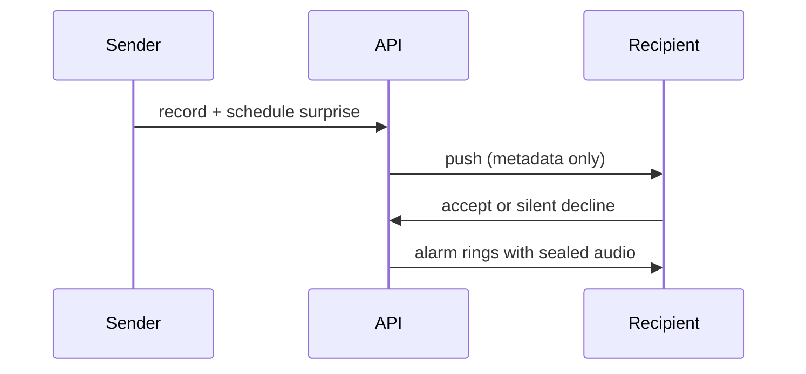

# Hi, I'm Rafael 👋

**Backend engineer** building production Rails APIs and mobile-backed products.

📍 Vera, Spain · 💼 [LinkedIn](https://linkedin.com/in/rafael-augusto-pissardo)

---

## What I'm building

### [WakupCall](https://github.com/rafael-pissardo/wakupcall-api) — social alarms with sealed voice surprises

Wake up to someone you love — not a generic ringtone.

Someone records a voice message, schedules a delivery, and the recipient sees **who** and **when** — never the audio — until the alarm fires. Declining is **silent** for the sender.

| | [API](https://github.com/rafael-pissardo/wakupcall-api) | [Android](https://github.com/rafael-pissardo/wakupcall-android) |
|---|---|---|
| **Stack** | Rails 8 · Ruby 3.4 · PostgreSQL · JWT · FCM | Kotlin · Jetpack Compose · Material 3 · Room |
| **Highlights** | Sealed audio · silent decline · Pundit auth · Rack::Attack · offline `/sync` | Exact alarms · home widget · guided onboarding · surprise replay · [download APK](https://github.com/rafael-pissardo/wakupcall-android/releases/latest/download/wakupcall.apk) |
| **Deploy** | Railway · GitHub Actions CI | GitHub Actions · Paparazzi snapshots |

---

## Featured repos

| Project | Description |
|---------|-------------|
| [wakupcall-api](https://github.com/rafael-pissardo/wakupcall-api) | Rails backend — auth, alarms, sealed surprise delivery, push notifications |
| [wakupcall-android](https://github.com/rafael-pissardo/wakupcall-android) | Android client — Compose UI, offline sync, exact alarms, home widget |

---

## Open source & Rails ecosystem

I work closely with the **Rails background jobs** stack and follow the projects that power production job processing:

| Project | Why it matters |
|---------|----------------|
| [rails/solid_queue](https://github.com/rails/solid_queue) | Database-backed Active Job backend |
| [rails/mission_control-jobs](https://github.com/rails/mission_control-jobs) | Dashboard & ops for background jobs |
| [rubyonjets/jets](https://github.com/rubyonjets/jets) | Serverless Ruby on AWS Lambda |

---

## Tech stack

`Ruby` · `Ruby on Rails` · `Active Job` · `PostgreSQL` · `JWT` · `Kotlin` · `Jetpack Compose` · `REST APIs` · `FCM` · `GitHub Actions`

---

## GitHub activity

---

## Get in touch

- 💼 [LinkedIn](https://linkedin.com/in/rafael-augusto-pissardo)
- 🐙 GitHub [@rafael-pissardo](https://github.com/rafael-pissardo)
- 📦 [WakupCall API](https://github.com/rafael-pissardo/wakupcall-api) · [Android app](https://github.com/rafael-pissardo/wakupcall-android)
