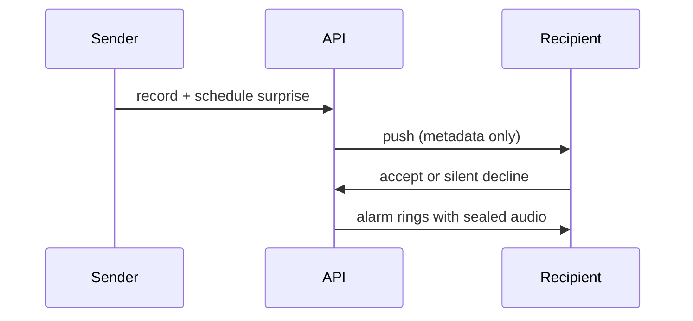

<picture>
  <source media="(prefers-color-scheme: dark)" srcset="assets/header-dark.svg">
  <source media="(prefers-color-scheme: light)" srcset="assets/header-light.svg">
  
</picture>

  <strong>Senior Rails & Product Engineer</strong> 
  I help teams ship business-critical software — modernize Rails systems, stabilize background jobs, and keep delivery moving.

  
  
  

  
  
  

---

## Current focus

Building and operating **Rails backends** where product decisions, reliability, and architecture intersect.

| Area | What I'm working on |
|------|---------------------|
| **Rails modernization** | Rails 8, Solid Queue, cleaner Active Job boundaries |
| **Background jobs** | Sidekiq → Solid Queue migrations, queue observability, failure recovery |
| **Reliability** | Datadog, incident prevention, systems that stay boring under load |
| **Product engineering** | End-to-end ownership from API design to shipped user outcomes |
| **AI-assisted workflows** | Faster delivery with stronger review, testing, and documentation discipline |

> I work best where product, reliability, and backend architecture meet.

---

## Technical strengths

| Strength | Proof in practice |
|----------|-------------------|
| **Rails backend architecture** | Production APIs with auth, authorization, rate limiting, and mobile-first sync |
| **Job processing at scale** | Active Job, Solid Queue, Sidekiq migration patterns, operational dashboards |
| **Data & persistence** | PostgreSQL schema design, transactional workflows, offline sync contracts |
| **Observability & ops** | Metrics, tracing, actionable alerts — fewer surprises in production |
| **Product-minded delivery** | Full-stack product builds spanning API, mobile client, CI/CD, and deployment |
| **Remote collaboration** | Async-friendly docs, clear PRs, maintainable systems for distributed teams |

---

## Signature work

### [WakupCall](https://github.com/rafael-pissardo/wakupcall-api) — social alarms with sealed voice surprises

A product I designed and built end-to-end: **Rails API + Android client**, from domain modeling to production deployment.

Someone records a voice message, schedules delivery, and the recipient sees **who** and **when** — never the audio — until the alarm fires. Declining is **silent** for the sender.

<table>
<tr>
<th><a href="https://github.com/rafael-pissardo/wakupcall-api">API</a></th>
<th><a href="https://github.com/rafael-pissardo/wakupcall-android">Android</a></th>
</tr>
<tr>
<td>

Rails 8 · Ruby 3.4 · PostgreSQL · JWT · FCM

Sealed audio · silent decline · Pundit · Rack::Attack · offline `/sync`

Railway · GitHub Actions CI

</td>
<td>

Kotlin · Jetpack Compose · Material 3 · Room

Exact alarms · home widget · offline-first sync · Paparazzi snapshots

<a href="https://github.com/rafael-pissardo/wakupcall-android/releases/latest/download/wakupcall.apk">Download APK</a>

</td>
</tr>
</table>

**Why it matters:** domain-driven API design, privacy-sensitive media handling, mobile sync contracts, and production-ready Rails patterns — not a tutorial app.

---

## Featured repositories

| Repository | Role | Stack |
|------------|------|-------|
| [**wakupcall-api**](https://github.com/rafael-pissardo/wakupcall-api) | Production Rails backend — auth, alarms, sealed delivery, push | Rails 8 · PostgreSQL · JWT · FCM |
| [**wakupcall-android**](https://github.com/rafael-pissardo/wakupcall-android) | Android client — Compose UI, offline sync, exact alarms | Kotlin · Compose · Room |
| [**rafael-pissardo**](https://github.com/rafael-pissardo/rafael-pissardo) | Profile, positioning, and public engineering notes | Markdown · GitHub Profile |

**Coming soon** *(repos in progress — see [execution plan](GITHUB_PROFILE_STRATEGY.md))*:

| Planned repo | Purpose |
|--------------|---------|
| `rails-job-migration-playbook` | Sidekiq → Solid Queue migration notes, checklists, and trade-offs |
| `rails-observability-kit` | Datadog + Rails patterns for metrics, traces, and alert hygiene |
| `ai-rails-engineering` | Practical AI-assisted Rails workflows with review guardrails |

---

## Tech stack

  
  
  
  
  
  
  
  
  
  
  

---

## Writing & experiments

Documenting patterns I use in production — focused on **maintainable Rails systems**, not hype.

| Topic | Status |
|-------|--------|
| Solid Queue adoption & Sidekiq migration checklists | drafting |
| Rails observability: metrics that prevent incidents | planned |
| AI-assisted engineering with senior review discipline | planned |
| Product API design for mobile offline sync | live in WakupCall repos |

---

## Contact

| | |
|---|---|
| **LinkedIn** | [linkedin.com/in/rafael-augusto-pissardo](https://linkedin.com/in/rafael-augusto-pissardo) |
| **Email** | [rpissardo@hotmail.com](mailto:rpissardo@hotmail.com) |
| **GitHub** | [@rafael-pissardo](https://github.com/rafael-pissardo) |
| **Availability** | Remote · Europe timezone · International B2B & contract |

If you're building a Rails product, migrating background jobs, or need a senior engineer who owns outcomes — let's talk.
