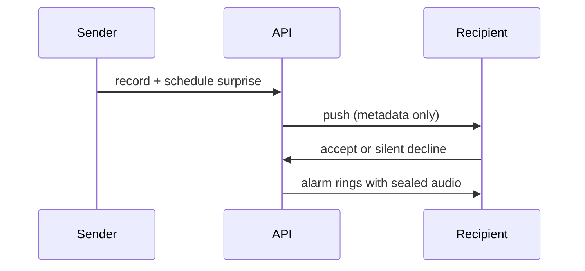

<picture>
  <source media="(prefers-color-scheme: dark)" srcset="assets/header-dark.svg">
  <source media="(prefers-color-scheme: light)" srcset="assets/header-light.svg">
  
</picture>

<p align="center">
  <strong>Senior Rails & Product Engineer</strong><br/>
  Gems, APIs, and apps for production Rails systems.
</p>

<p align="center">
  
  
</p>

<p align="center">
  <a href="https://linkedin.com/in/rafael-augusto-pissardo"></a>
  <a href="mailto:rpissardo@hotmail.com"></a>
  <a href="https://rubygems.org/gems/solid_queue_guard"></a>
</p>

---

## Gems

### [solid_queue_guard](https://github.com/rafael-pissardo/solid_queue_guard)

Production readiness checks and runtime guards for [Solid Queue](https://github.com/rails/solid_queue).

Detects queue lag, dead workers, unsafe pool config, and broken recurring jobs — before they become incidents.

| | |
|---|---|
| **RubyGems** | [solid_queue_guard](https://rubygems.org/gems/solid_queue_guard) |
| **Latest** | [](https://rubygems.org/gems/solid_queue_guard) |
| **Downloads** | [](https://rubygems.org/gems/solid_queue_guard) |
| **Stack** | Ruby 3.1+ · Rails 7.1–8 · Mission Control integration |

```bash
bundle add solid_queue_guard
```

---

## Apps

### [WakupCall](https://github.com/rafael-pissardo/wakupcall-api) — social alarms with sealed voice surprises

Someone records a voice message, schedules delivery, and the recipient sees **who** and **when** — never the audio — until the alarm fires. Declining is silent for the sender.

| | [API](https://github.com/rafael-pissardo/wakupcall-api) | [Android](https://github.com/rafael-pissardo/wakupcall-android) |
|---|---|---|
| **Stack** | Rails 8 · Ruby 3.4 · PostgreSQL · JWT · FCM | Kotlin · Jetpack Compose · Room |
| **Highlights** | Sealed audio · silent decline · Pundit · offline `/sync` | Exact alarms · home widget · offline-first sync |
| **Links** | Railway · GitHub Actions | [Download APK](https://github.com/rafael-pissardo/wakupcall-android/releases/latest/download/wakupcall.apk) |



### [Bluetile](https://github.com/rafael-pissardo/Bluetile) — user integrity check API

Real-time integrity scoring for mobile users: country whitelist, device trust, and VPN/Tor detection in a hardened Rails 8 endpoint.

| | |
|---|---|
| **Stack** | Rails 8.1 · Ruby 3.4 · PostgreSQL · Redis |
| **Highlights** | Deterministic check chain · API key auth · rate limiting · fail-open external calls · audit logging |

---

## Featured repos

| Repository | Type | What it is |
|------------|------|------------|
| [**solid_queue_guard**](https://github.com/rafael-pissardo/solid_queue_guard) | Gem | Production doctor for Solid Queue |
| [**wakupcall-api**](https://github.com/rafael-pissardo/wakupcall-api) | App | Rails backend for sealed social alarms |
| [**wakupcall-android**](https://github.com/rafael-pissardo/wakupcall-android) | App | Kotlin client — Compose, offline sync, exact alarms |
| [**Bluetile**](https://github.com/rafael-pissardo/Bluetile) | App | Rails API for real-time user integrity checks |

---

## Stack

<p>
  
  
  
  
  
  
  
  
</p>

---

## Contact

| | |
|---|---|
| **LinkedIn** | [linkedin.com/in/rafael-augusto-pissardo](https://linkedin.com/in/rafael-augusto-pissardo) |
| **Email** | [rpissardo@hotmail.com](mailto:rpissardo@hotmail.com) |
| **GitHub** | [@rafael-pissardo](https://github.com/rafael-pissardo) |
| **RubyGems** | [solid_queue_guard](https://rubygems.org/gems/solid_queue_guard) |
| **Availability** | Remote · Europe · International B2B & contract |
